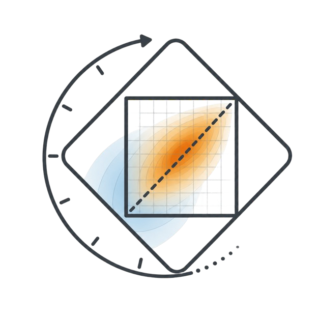

<p align="center">
  
</p>

<h1 align="center">TimePLE: Rethinking Temporal Representation for Video Temporal Grounding</h1>

<p align="center">
  Yuhui Zeng<sup>1,4</sup>, Xinyu Mao<sup>2,4</sup>, Xiaokun Liu<sup>4</sup>, Xin Tao<sup>4</sup>,
  Jinfa Huang<sup>3</sup>, Jiayi Ji<sup>1</sup>, Xiawu Zheng<sup>1</sup>
</p>

<p align="center">
  <sup>1</sup>Xiamen University &nbsp;&nbsp;
  <sup>2</sup>The Chinese University of Hong Kong &nbsp;&nbsp;
  <sup>3</sup>University of Rochester &nbsp;&nbsp;
  <sup>4</sup>Kling Team, Kuaishou Technology
</p>

<p align="center">
  <a href="https://arxiv.org/abs/2607.23951">📄 <b>Paper</b></a> |
  <a href="https://huggingface.co/KlingTeam/TimePLE">🤗 <b>Model</b></a> |
  <a href="https://huggingface.co/datasets/KlingTeam/TimePLE-Dataset">🗃️ <b>Data</b></a>
</p>

## News

- **2026-07-20:** Released the TimePLE codec, Qwen3-VL integration, SFT, data-curation pipeline, and public training configurations.
- **Available:** The TimePLE checkpoint, training annotations, benchmark annotations, and inference/evaluation suite are available now.

## Overview

Video temporal grounding (VTG) aims to localize the continuous video interval described by a natural-language query. Existing VLM-based methods commonly represent an interval through two endpoint outputs, either as timestamp tokens or continuous boundary coordinates.

TimePLE reformulates VTG as **interval-native prediction**. It maps every valid temporal interval to a point in a canonical position-duration square and predicts a single joint distribution over this space. A generated `<|TIMESPAN|>` token provides the latent output interface, while input-side `<|TIMESTAMP|>` tokens encode the temporal coverage of sampled visual units using the same interval geometry.

```text
video + query
     |
     |  temporal anchors encoded by <|TIMESTAMP|>
     v
   VLM hidden states
     |
     |  generated <|TIMESPAN|>
     v
joint distribution over the canonical position-duration square
     |
     |  expectation decoding + duration-aware residual refinement
     v
continuous temporal interval [start, end]
```

The released codec uses a `128 x 128` canonical grid, Gaussian bandwidth `sigma_u = sigma_v = 0.015`, and duration-adaptive residual scale `alpha = 0.02`.

## Release Status

| Component | Status | Entry point |
|---|:---:|---|
| TimePLE interval codec | ✅ | `src/timeple/models` |
| Geometry pretraining | ✅ | `src/timeple/geometry_pretrain` |
| Qwen3-VL / Transformers integration | ✅ | `integrations/transformers` |
| SFT / ms-swift integration | ✅ | `integrations/ms_swift` |
| GRPO / EasyR1 integration | ✅ | `integrations/easyr1` |
| Training-data curation | ✅ | `data_pipeline/train_building` |
| Benchmark human-review tools | ✅ | `data_pipeline/bench_cleaning` |
| TimePLE-8B checkpoint | ✅ | [KlingTeam/TimePLE](https://huggingface.co/KlingTeam/TimePLE) |
| Training and benchmark annotations | ✅ | [KlingTeam/TimePLE-Dataset](https://huggingface.co/datasets/KlingTeam/TimePLE-Dataset) |
| Benchmark inference and evaluation | ✅ | `evaluation` |

## Quick Navigation

- [Installation](#installation)
- [Data Preparation](#data-preparation)
- [Training TimePLE](#training-timeple)
- [Data Curation](#data-curation)
- [Charades-TimePLE](#charades-timeple)
- [Inference and Evaluation](#inference-and-evaluation)
- [Implementation Notes](#implementation-notes)

## Installation

Clone the repository and enter the project directory:

```bash
git clone https://github.com/KlingAIResearch/TimePLE.git
cd TimePLE
```

TimePLE uses `uv` to reproduce exact upstream environments. Build the environment required by the stage you want to run:

```bash
# Supervised fine-tuning
bash scripts/setup_env.sh sft

# Reinforcement-learning post-training
bash scripts/setup_env.sh rl

# Data curation
bash scripts/setup_env.sh data-pipeline
```

The setup script installs the exact upstream versions recorded in `uv.lock`, validates their versions and source hashes, and then applies the TimePLE integration patches. The repository does not contain complete copies of Transformers, ms-swift, or EasyR1 source files.

The SFT and RL extras are intentionally separate because accelerator stacks often require platform-specific dependency pins. `uv.lock` records the reference resolution.

### Loading the released model

The Hugging Face checkpoint is a weights-and-assets repository. The executable TimePLE implementation is provided by this installable source package rather than duplicated in the model repository. Import `timeple` once to register the custom configuration, model, and processor with Transformers; Hub-hosted Python code and `trust_remote_code=True` are not required.

```python
import torch
import timeple
from transformers import AutoModelForImageTextToText, AutoProcessor

model_id = "KlingTeam/TimePLE"
processor = AutoProcessor.from_pretrained(model_id)
model = AutoModelForImageTextToText.from_pretrained(
    model_id,
    dtype=torch.bfloat16,
    device_map="auto",
).eval()
```

## Data Preparation

Training and benchmark annotations are released separately as [KlingTeam/TimePLE-Dataset](https://huggingface.co/datasets/KlingTeam/TimePLE-Dataset). Licensed videos, pretrained weights, and generated checkpoints are not redistributed in this GitHub repository. Place local artifacts under the following repository-relative structure:

```text
TimePLE/
├── checkpoints/
│   ├── base-model/           # Qwen3-VL-8B-Instruct
│   ├── geometry/             # selected geometry artifacts
│   ├── sft-stage1/           # selected stage-1 checkpoint
│   └── TimePLE-8B/           # final release-ready SFT model
└── data/
    ├── TimePLE-Dataset/      # full local annotation package; ignored by Git
    ├── sft.jsonl             # committed schema examples
    └── rl_train.jsonl        # committed schema examples
```

All committed YAML files use paths relative to the TimePLE repository root. The launchers export `TIMEPLE_ROOT` automatically, so machine-specific absolute paths do not need to be committed.

The committed `sft.jsonl` and `rl_train.jsonl` records are 100 text-only schema examples with placeholder video names. They demonstrate the training interface and are not the paper training set. The SFT configs read the full local package from `data/TimePLE-Dataset/train/timeple_train.jsonl`.

Convert local temporal annotations into the TimePLE SFT and EasyR1 schemas with:

```bash
uv run python scripts/data/prepare_sft.py \
  --input /path/to/temporal_annotations.jsonl \
  --output data/sft.jsonl \
  --count 100 \
  --seed 2

uv run python scripts/data/prepare_rl.py \
  --input data/sft.jsonl \
  --output data/rl_train.jsonl
```

See [`data/README.md`](data/README.md) and [`scripts/data/README.md`](scripts/data/README.md) for the record schemas.

## Training TimePLE

TimePLE training consists of three independently launched runs:

1. interval geometry pretraining;
2. SFT stage 1 with the interval codec frozen;
3. SFT stage 2 with the interval codec unfrozen.

The repository does not automatically promote checkpoints between stages. After each run, inspect the validation results and expose the selected artifact at the stable repository-relative path expected by the next config.

### Stage 0: Interval Geometry Pretraining

```bash
uv run python -m timeple.geometry_pretrain \
  --config configs/model/geometry_pretrain_v1.yaml
```

Each run is saved under a timestamped directory in `outputs/geometry_pretrain_v1/`. After selecting a run, provide:

```text
checkpoints/geometry/best.pt           <- best_timeple_codec_state_dict.pt
checkpoints/geometry/codec_config.json <- codec_config_resolved.json
```

You may copy or link the selected files, or update the stage-1 config to another repository-relative location.

### Stage 1: Frozen-Codec SFT

```bash
bash scripts/sft/train_stage1.sh
```

Stage 1 loads the selected geometry state, freezes the TimePLE encoder and decoder, and trains the language-side temporal interface. Its validation set is created from the full local annotation package through the deterministic split configured in `configs/sft/timeple_sft_stage1.yaml`.

After training, expose the selected checkpoint as `checkpoints/sft-stage1/` or update the stage-2 `model` field.

### Stage 2: Joint SFT

```bash
bash scripts/sft/train_stage2.sh
```

Stage 2 starts from the selected stage-1 model and unfreezes the TimePLE encoder and decoder. It independently creates a deterministic validation split from `data/TimePLE-Dataset/train/timeple_train.jsonl`.

The final release-ready SFT model is stored locally at `checkpoints/TimePLE-8B/`.

### Optional Post-Training

```bash
# GRPO used in the paper's post-SFT study
bash scripts/rl/train_grpo.sh

# Experimental repository extensions
bash scripts/csdo/train_csdo.sh
bash scripts/tr_spd/train_tr_spd.sh
```

CSDO and TR-SPD are experimental extensions and are not required for the paper's main TimePLE-SFT result.

## Data Curation

The training-data pipeline combines heterogeneous teacher VLMs to verify existing temporal annotations and construct additional grounded samples from cross-model event consensus.

The public implementation provides:

- deterministic preprocessing for Charades-STA and ActivityNet-Captions;
- Gemini and local-vLLM teacher backends;
- agreement-based filtering of existing samples;
- temporal and semantic consensus for newly constructed samples;
- conversion into TimePLE SFT and RL supervision formats.

Start from [`data_pipeline/README.md`](data_pipeline/README.md). Teacher checkpoints, API credentials, raw annotations, and licensed videos are supplied locally through copied configuration templates and are never hard-coded in the repository.

## Charades-TimePLE

Charades-TimePLE is the human-verified corrected benchmark described in the paper. Its annotations are distributed together with the TimePLE training set in the unified Hugging Face dataset repository:

> [!IMPORTANT]
> **Dataset:** [KlingTeam/TimePLE-Dataset](https://huggingface.co/datasets/KlingTeam/TimePLE-Dataset)

The dataset repository provides the training annotations, corrected benchmark
annotations, WebDataset video shards, and integrity metadata.

The human-review interface and annotation-application tools are already available under [`data_pipeline/bench_cleaning`](data_pipeline/bench_cleaning).

## Inference and Evaluation

The public evaluation suite supports Charades-STA, ActivityNet-Captions, and QVHighlights with layered dataset/model/prompt profiles, resumable prediction files, distributed sharding, and duration-stratified metrics.

Install the evaluation environment and render a suite without loading the model:

```bash
bash scripts/setup_env.sh eval
uv run python evaluation/src/run_eval_suite.py \
  --suite evaluation/configs/suites/charades_sta.yaml
```

Run TimePLE on a benchmark with:

```bash
SUITE=charades_sta bash scripts/eval/run_suite.sh --models timeple_8b
SUITE=activitynet_captions bash scripts/eval/run_suite.sh
SUITE=qvhighlights bash scripts/eval/run_suite.sh
```

See [`evaluation/README.md`](evaluation/README.md) for the expected annotation schema, data layout, output files, and distributed evaluation workflow.

> [!NOTE]
> The default evaluation profile follows the paper setting of 2 FPS, at most 200 frames, and at most 64 visual tokens per frame. These inference settings are independent of the public training YAML files.

## Implementation Notes

### Canonical Interval Codec

For a normalized interval `[s, e]` with duration `d = e - s`, TimePLE uses:

```text
u = s / (1 - d)
v = d
```

Every point `(u, v)` in the canonical square maps back to a valid interval. The output decoder predicts a joint distribution over the square, computes its expected coordinate, and applies a duration-aware bounded residual before recovering continuous boundaries.

### Temporal-Token Initialization

When `<|TIMESTAMP|>` and `<|TIMESPAN|>` are newly added, their input and output embeddings are initialized using the empirical mean and covariance statistics of the existing vocabulary embeddings. Temporal-token rows already present in a resumed TimePLE checkpoint are preserved.

### Repository Layout

| Path | Description |
|---|---|
| `src/timeple/models` | Canonical transform, codec, losses, and interface adapters |
| `src/timeple/geometry_pretrain` | Synthetic geometry training and diagnostics |
| `configs` | Model, SFT, RL, and DeepSpeed configurations |
| `integrations/transformers` | Versioned Qwen3-VL integration patch and manifest |
| `integrations/ms_swift` | Versioned SFT integration patch and manifest |
| `integrations/easyr1` | GRPO, CSDO, and TR-SPD integration |
| `data_pipeline` | Training-data curation and benchmark correction |
| `rewards` | Temporal localization and format rewards |

## Validation

Run the lightweight repository checks without launching distributed training:

```bash
bash scripts/setup_env.sh dev
uv run pytest
uv run python -m compileall -q src integrations rewards scripts tests
bash -n scripts/sft/*.sh scripts/rl/*.sh scripts/csdo/*.sh scripts/tr_spd/*.sh
```

## Citation

If you find TimePLE useful for your research, please consider citing our work:

```bibtex
@article{zeng2026timeple,
  title   = {TimePLE: Rethinking Temporal Representation for Video Temporal Grounding},
  author  = {Zeng, Yuhui and Mao, Xinyu and Liu, Xiaokun and Tao, Xin and Huang, Jinfa and Ji, Jiayi and Zheng, Xiawu},
  journal = {arXiv preprint},
  year    = {2026}
}
```

The citation entry will be updated with the final arXiv identifier.

## Acknowledgement

TimePLE is built upon the following open-source projects:

- [Qwen3-VL](https://github.com/QwenLM/Qwen3-VL)
- [Hugging Face Transformers](https://github.com/huggingface/transformers)
- [ModelScope ms-swift](https://github.com/modelscope/ms-swift)
- [EasyR1](https://github.com/hiyouga/EasyR1)
- [verl](https://github.com/volcengine/verl)

See [`THIRD_PARTY_NOTICES.md`](THIRD_PARTY_NOTICES.md) for integration details and upstream licenses.

## License

TimePLE is released under the [Apache License 2.0](LICENSE). This repository does not redistribute third-party datasets, licensed videos, or pretrained model weights.
